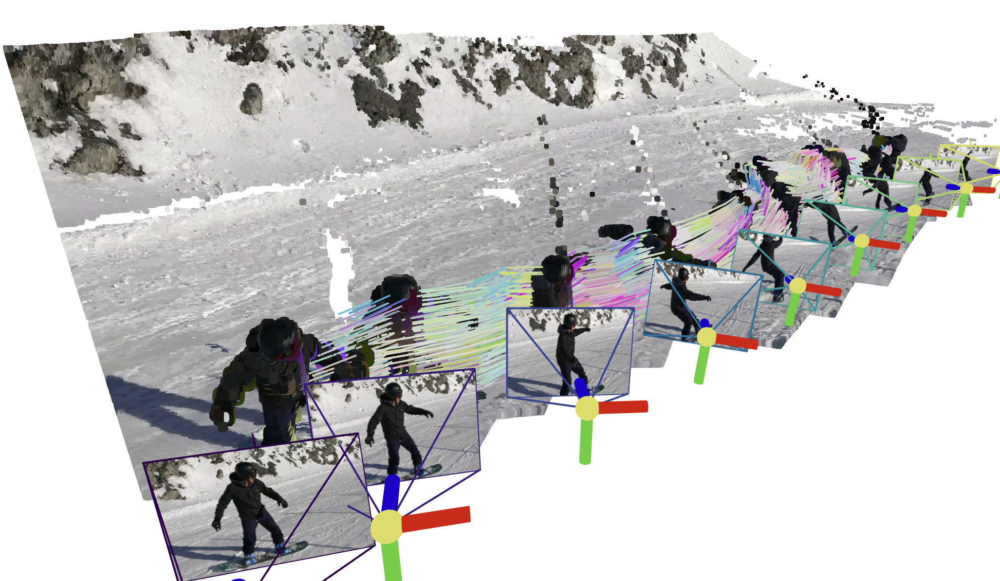

# SpatialTrackerV2: 3D Point Tracking Made Easy

**[CAD&CG, Zhejiang University](https://github.com/zju3dv)**; **[University of Oxford](https://www.robots.ox.ac.uk/~vgg/)**; **[Ant Research](https://www.antresearch.com/)**; **[Pixelwise AI](http://pixelwise.ai/)**; **[Bytedance Seed](https://seed.bytedance.com/zh/)**

[Yuxi Xiao](https://henry123-boy.github.io/), [Jianyuan Wang](https://jytime.github.io/), [Nan Xue](https://xuenan.net/), [Nikita Karaev](https://nikitakaraevv.github.io/), [Iurii Makarov](https://linkedin.com/in/lvoursl), [Bingyi Kang](https://bingykang.github.io/), [Xin Zhu](https://openreview.net/profile?id=~Xing_Zhu2), [Hujun Bao](http://www.cad.zju.edu.cn/home/bao/), [Yujun Shen](https://shenyujun.github.io/), [Xiaowei Zhou](https://www.xzhou.me/)

### [Project Page](https://spatialtracker.github.io/) | [BibTeX]() | [Google Drive](https://drive.google.com/drive/u/1/folders/1GYeC639gA23N_OiytGHXTUCSYrbM0pOo?dmr=1&ec=wgc-drive-globalnav-goto) 

<!-- [Paper V1]() | [Paper V2]() | [Paper V3]() | -->

<a href="./docs/PAPER.md" target="_blank" rel="noopener noreferrer">
  
</a>
<a target="_blank" href="">
  
</a>
<a href="https://huggingface.co/spaces/Yuxihenry/SpatialTrackerV2">
  
</a>





## 📰 Latest Updates & News

- **[June 27, 2025]**: SpatialTrackerV2 accepted by ICCV 2025
- **[June 23, 2025]**: Huggingface Space Demo launched! Try it out: 🤗 [Huggingface Space](https://huggingface.co/spaces/Yuxihenry/SpatialTrackerV2)

## TODO List
   - [x] Release quick start of `SpaTrack2-offline` 
   - [ ] Final version of Paper at [PAPER.md](./docs/PAPER.md)
   - [ ] Release `SpaTrack2-online`
   - [ ] Training & Evaluation Codes.
   - [ ] More supports for other Depth Model, *e.g.*, `DepthAnything`, `StereoFoundation`, `UniDepth`, `Metric3D`.
   - [ ] `Ceres Python Bindings` designed for SpatialTracker and Dynamic Reconstruction.

## Set up the environment
To set up the environment for running the SpaTrack model, follow these steps:

1. **Clone the Repository:**
   ```bash
   # clone the code
   git clone https://github.com/henry123-boy/SpaTrackerV2.git
   cd SpaTrackerV2
   
   # optionally download the example data to run the examples
   # Note: This will slowdown the clonining process, as it includes large files.
   git submodule update --init --recursive
   ```
   

2. **Create a Virtual Environment:**
   It's recommended to use a virtual environment to manage dependencies.
   ```bash
   conda create -n SpaTrack2 python=3.11
   conda activate SpaTrack2
   ```

3. **Install Dependencies:**

   Install the torch dependencies `pip` (tested with `torch2.4`).
   ```bash
   python -m pip install torch==2.4.1 torchvision==0.19.1 torchaudio==2.4.1 --index-url https://download.pytorch.org/whl/cu124
   ```

   Install the required Python packages using `pip`.
   ```bash
   python -m pip install -r requirements.txt
   ```

By following these steps, you should have a working environment ready to run the SpaTrack model.


## Quick Start
Here are two examples of how to use `SpaTrack2`. 
### Type1: Monocular video as input *(Example0)*
```
python inference.py --data_type="RGB" --data_dir="examples" --video_name="protein" --fps=3
```

### Type2: RGBD video + Camera poses as input *(Example1)*
We provide an example with Depth and Camera poses from [MegaSAM](https://github.com/mega-sam/mega-sam). 
First, download the `examples` via:
```
sh scripts/download.sh
```   
Then run inference with the command with below:
```
python inference.py --data_type="RGBD" --data_dir="assets/example1" --video_name="snowboard" --fps=1
```  


### Visualize your results
Guidance will be displayed in the terminal after running `inference.py`.

## 🌟 Recommended: Gradio Demo with SAM 🌟
Please follow the instructions in the [app_3rd README](app_3rd/README.md) to configure the dependencies. Then, install the required packages: 
```
python -m pip install gradio==5.31.0 pako
```
Our Gradio demo enables users to easily track points on the target object. Just try:
```
python app.py
```


